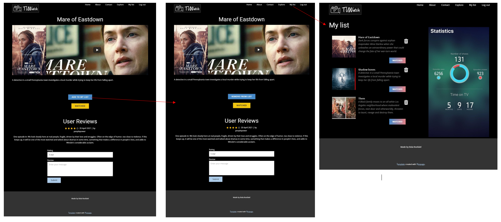

# Features + User interfaces (sketches)
in this paragraph the different features that the user can do are supported with the user interfaces that belong with the feature. It will give a good impression of the site that is going to be build

- User registration + filling interest form

- User login

- User log out

- User can click on about to read more about the function of the site

- User can click on contact to contact us

- User can click on a title to see the detailed page

- User can add Tv-shows into My-List

- User can remove Tv-shows from My-list

- User can mark a Tv-show as watched (extra)

- User can add own Reviews to a tv-show (extra)

# Database
Here you can see the database structures that are going to be implemented to make the application possible

# Lists
I am using an API from TMDB, this will help me to make a good reccomendation from the input/data i receive from the user.
The parameters i can use to get the relevent information are described at the following site: https://developers.themoviedb.org/4/getting-started/authorization  

## Problem statement

Currently there are many Tv-shows in the world and a lot of people don't know which series they are going to like. That is why the app is relevant to users who are looking for series which match with ther own interest. This application will give the user Tv-shows that match with their interest.

## Solution description

To Solve the problem that we have sketched in the previous paragraph there are a couple implementations that must be made to make this solution possible:

- [x] A home page with the most recent/upcoming tv-shows. The homepage has to have an option to let people register and make an personal account. 
- [x] A page where the user can register
- [x] A page with a form where the user has to answer questions about the interest they find important in TV-shows, for example:
    - Genres the user likes to see in a Tv-Show
    - Spoken language of a Tv-show
    - Region of the Tv-show
    - Duration of episodes
    - Minimum rating of a Tv-show
- [x] A page where the user can see the tv-shows that are matched based on the interest filled in by the user. (using an API from IMDB)
- [x] An option to open a Tv-show for more detail
- [x] A page with all the Tv-shows that the user is going to watch or has watched (My-List).
- [x] (extra) removing tv-shows added in My-list.
- [x] (extra) An option to open a tvshow. Based on on this Tv-shows giving more related shows like the one opened.
- [x] (extra) Trying to make the site responsive.
- [x] (extra) Trying to make the site dynamic. This can be achieved by implementing the following features:

## Details and sketches

Make sure that this readme is well-readable when viewed via GitHub! Images should be appropriately sized, text and images should be clearly related etc.

# Technical overview

### path("", views.index, name="index")

- This path returns the user to the home page.

### path("login", views.login_view, name="login")

- This path lets the user log in if he has an account.
- Returns the user to the reccomendation page.

### path("logout", views.logout_view, name="logout")
- This path logs the user out if he is logged in.
- Returns the user to the home page.

### path("register", views.register, name="register")

- This path lets the user make a personal account (register).
- Return the user to the interest page.

### path("add_interest",views.add_interest, name ="add_interest")
- This path saves the user interest in a database.
- It fetches from the api the Tv-shows based on the filled interest.
- Returns the user to the reccomendation page.

### path("detail_view",views.detail_view, name ="detail_view")

- This path fetches the youtube trailer, detailed info of the Tv-show and the similar Tv-shows.
- Returns the user to the detail page.

### path("add_mylist",views.add_mylist, name ="add_mylist")

- This path saves the name and tvid off the added tv-show in the database.
- It fetches info about the saved tv-shows of the user.
- Returns the user to the My List page.

### path("remove_mylist",views.remove_mylist, name ="remove_mylist")
- This path removes the name and tvid of the Tv-show the user wants to remove
- Returns the user to the My List page.

### path("about", views.about_view, name="about")

- This path returns the user to the about page.