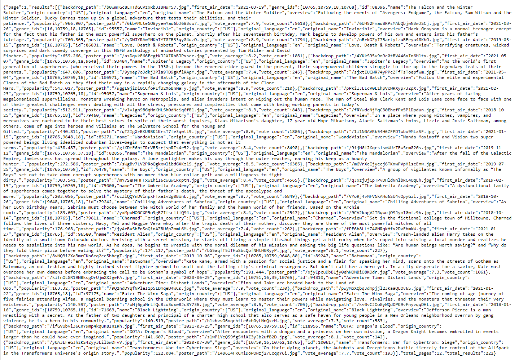

# TVWatch
A Django based Web application that shows reccomended TV-shows to the user fetching information from TMDB. It saves the interest of the user in a database when ceating an account. It also fetches a **Youtube Trailer** link from the TMDB API. The application is meant for people who are fan of watching Tv-shows and are looking for more reccomended tv-shows based on their interest.

### Installations
```
python -m pip install Django
```

## Let's Start
```
python manage.py runserver
```
## Structure:
The code for this website can be found in the map tvwatch, The map contains:
- templates (where the html code is stored)
- static (where the JS and CSS files are stored)
- views.py (where the core functionality is stored)
- models.py (where the user database is stored)

## Demo:


Hover above a Tv-show for a description and the option to get more **Details** and ***Watch the Trailer***.  
  
Its your own personalized **IMdb** and **Youtube** for Tv-shows.


Users can add Tv-shows to their personal list and remove Tv-shows from their list at the "My List page".

**reccomended tv-shows/Similar Tv-shows:**  
User can get reccomended Tv-shows based on Rating,Year, Genre, Language and Release date when making an account.
The User can get similar Tv-show when arriving at the detail page. These similar Tv-show are based on the current detailed tv-show the user has open.  

## Screencast

https://user-images.githubusercontent.com/78794187/119789473-606c0180-bed3-11eb-8512-274b188d86d1.mp4

Youtube url: https://youtu.be/N2ggwZZEZhQ

## Admin Access
Interest can be deleted or edited through the admin panel at **127.0.0.1:8000/admin**
But for that you will need to set up a superuser

```
python manage.py createsuperuser
```
And now you can delete or edit interest from the admin panel using the username and password you set. 

## API
This allows user to get get relevent movie information in form of JSON.
First you have to make an account at www.themoviedb.com and follow the instructions at this page to get a personal API KEY: https://developers.themoviedb.org/3/getting-started/introduction

Reccomended Tv-show data can be requested based on ***genre*** , ***language***, ***Average Vote***, ***Release year***.  
`f"https://api.themoviedb.org/3/discover/tv?sort_by=popularity.desc&api_key=ee98bfe4da01cc400b4f3028b791aee7&with_genres={genre}&with_original_language={language}&vote_average.gte={vote_average}&first_air_date.gte={release_year}"`  

Tv-show detail data can be requested based on ***name***.  
`"https://api.themoviedb.org/3/search/tv?api_key=ee98bfe4da01cc400b4f3028b791aee7&language=en-US&page=1&query={name}&include_adult=false"`  

Similar Tv-show data can be requested based on ***TvID***.  
`"https://api.themoviedb.org/3/tv/{tvid}/recommendations?api_key=ee98bfe4da01cc400b4f3028b791aee7&language=en-US&page=1"`

### Example reccomended Request: 
https://api.themoviedb.org/3/discover/tv?sort_by=popularity.desc&api_key=ee98bfe4da01cc400b4f3028b791aee7&with_genres=10765&with_original_language=en&vote_average.gte=6.0&first_air_date.gte=2018-01-01 

### Response:


## Authors
- Bola Roofaiel

## Acknowledgements
- Minor Programmeren van de UVA
